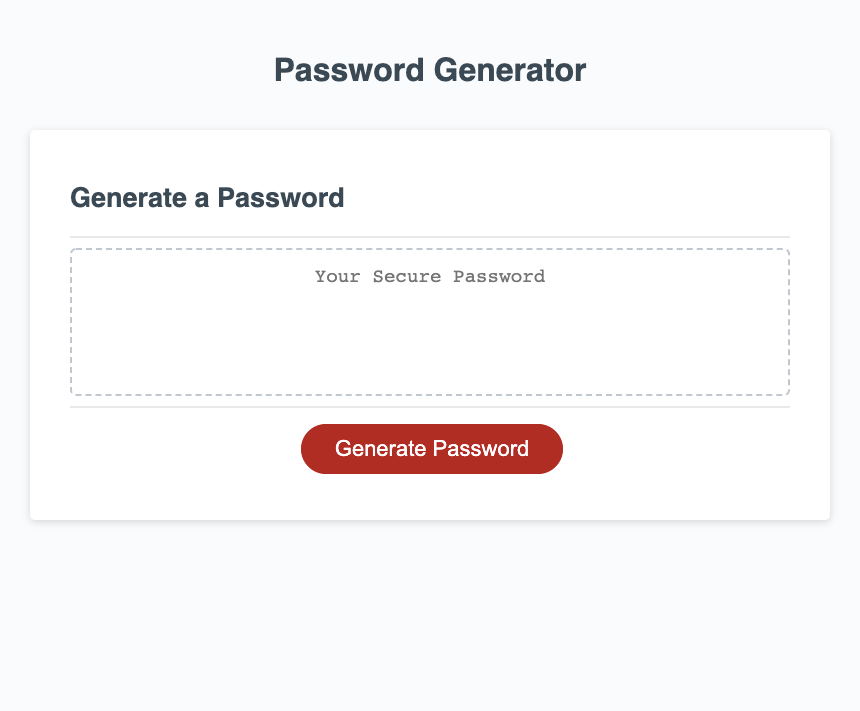

# Random Password Generator

## Description

This random password generator can be used to create a secure password based on user selected criteria. 

The objective of this project was to use JavaScript to generate a unique password based on user input.

## Installation

N/A

## Usage

This app can be used to generate a secure password based on user input. Users are prompted to select password character length, character case, and inclusion of numbers and/or special characters. Then a password meeting those specifications will be generated and displayed.

[Deployed Website Link](https://ameliabigler.github.io/feisty-iguana/)

## Credits

I referenced this site for 'for loop' syntax and shuffling strings:
https://stackoverflow.com/

I referenced this site for a list of special characters:
https://owasp.org/www-community/password-special-characters

## License

Please refer to the license in the repo.
